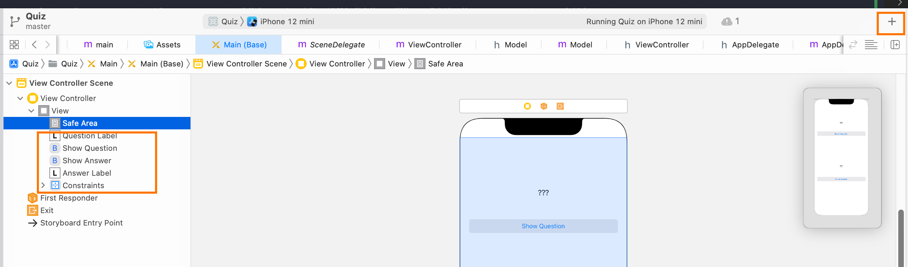
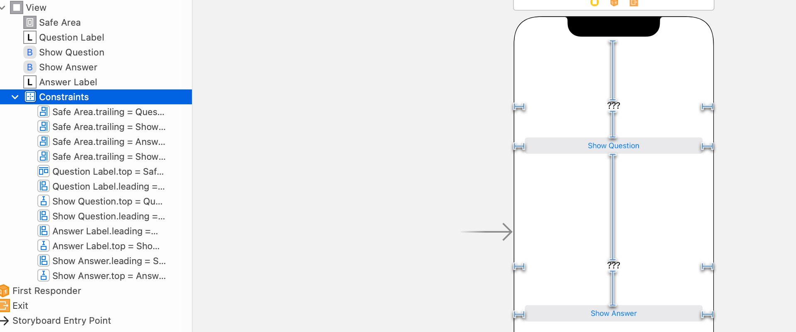
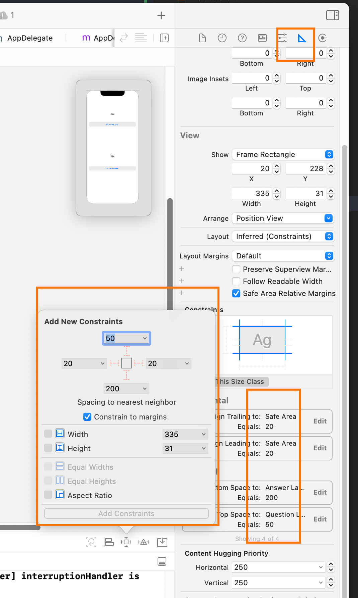
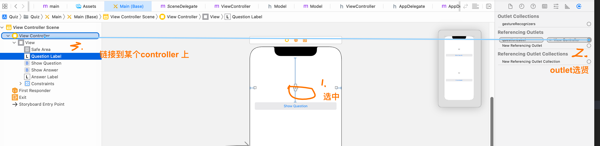
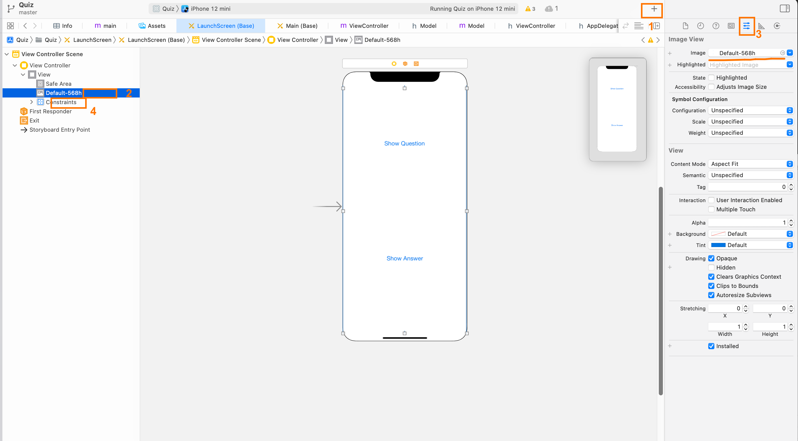
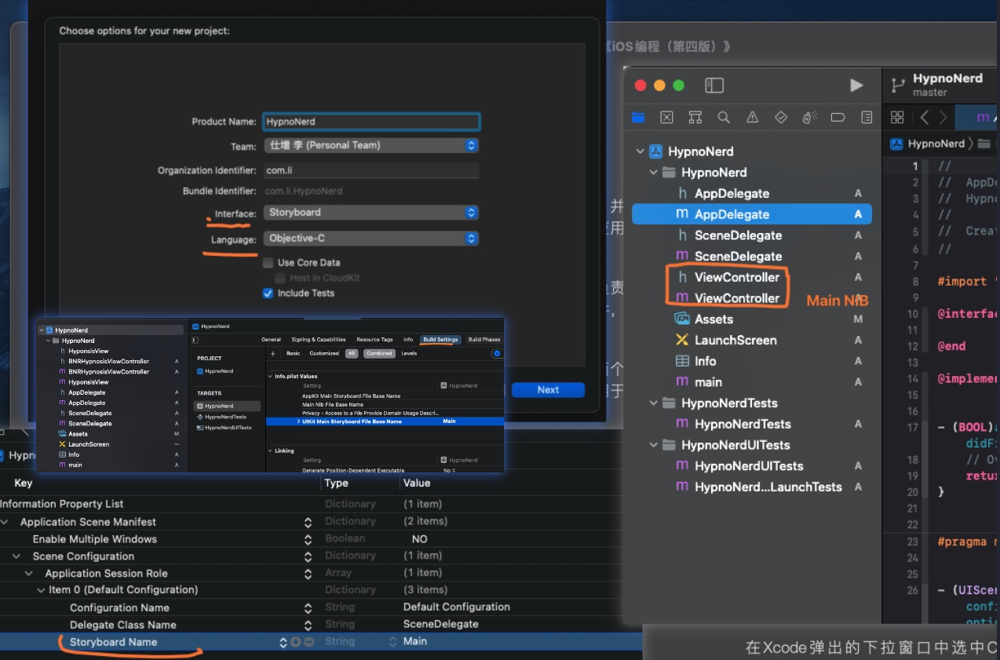

**《IOS编程 第四版》**
> 注意⚠️ 本项目中的部分场景，我结合了 Xcode 12 ，以构建IOS 13 以上的App 为目标（结合目前的IOS UIKit文档做说明），所以和书里面还是有点不一样的
> 注意 本书默认你已经学会了OC ，其中的OC知识点我们不会过多介绍，仅仅给出代码示例 介绍一些核心部分，基础的OC我们将直接略过

相关的文档 [Apple 简体中文](https://developer.apple.com/cn/documentation/) (建议直接英文真的)

这本书中的课后练习由三个层次 分别是 入门，深入，高级，我在这里不会线性取实现，而是学习整本书之后再回来实现

# 打通流程第一个IOS应用
>
> 由于目前 Xcode12 之后的项目创建的默认模板的选项中，interface 可选 StoryBoard，SwiftUI，Language 可选的有 OC 和Swift. 这就与书中的不一样的了，我在这里使用 StoryBoard + OC 去创建

目录简要说明:


其中Quiz下就是源代码目录了，有的时候我们还会有 基于 cocas的第三方依赖项 ，和前端的npm node_modules 是一样的道理

```shell
│   ├── AppDelegate.h 
│   ├── AppDelegate.m // Application的Delegate
│   ├── Assets.xcassets // 资源文件
│   │   ├── AccentColor.colorset
│   │   │   └── Contents.json
│   │   ├── AppIcon.appiconset
│   │   │   ├── Contents.json
│   │   │   └── Icon@2x.png
│   │   ├── Contents.json
│   │   └── Default-568h.imageset
│   │       ├── Contents.json
│   │       └── Default-568h@2x.png
│   ├── Base.lproj //两个storyboard （也是一种XIB文件 一种XML格式的文件 Xcode 会把这些xib编译称NIB 并且CV到bundle中 运行的时候就能加载到这些了）
│   │   ├── LaunchScreen.storyboard
│   │   └── Main.storyboard
│   ├── Info.plist
│   ├── SceneDelegate.h 
│   ├── SceneDelegate.m // IOS 13 之后的多屏Delegate
│   ├── ViewController.h
│   ├── ViewController.m // 一个 ViewController（它现在控制着Main.storyboard View视图 
│   └── main.m // App启动入口
```

## 我们先调整 Interface Builder 中的Main，构建几个UI

具体我们需要关注的是下面几个地方
在模板创建完成之后， 修改Main.storyboard
添加组件两个 label 和两个 button


额外的为了搞定位置关系 我们需要 设置一个 约束


选中组件之后，可以在这两个地方查看和添加 这些约束


点击重新构建到模拟器上，基本上你的应用外形就已经具备了, 现在我们来+model

## 编写Model

model 就是MVC中的M，负责数据的操作

model.h

```c
#import <Foundation/Foundation.h>

@interface Model : NSObject

@property (nonatomic, copy) NSArray *answers;
@property (nonatomic, copy) NSArray *questions;

// 携带参数的初始化
- (instancetype)initWithData:(NSArray *)answers quertion:(NSArray *)questions;
// 获取answers questions 依据ID
- (NSArray *)getAAndQ: (int)idx;

@end

```

model.m

```c

#import "Model.h"

@implementation Model

- (instancetype)initWithData:(NSArray *)questions quertion:(NSArray *)answers
{
    self.answers = answers;
    self.questions = questions;
    return self;
}

- (NSArray *)getAAndQ:(int)idx
{
    NSMutableArray *res = [NSMutableArray array];
    [res addObject:self.questions[idx]];
    [res addObject:self.answers[idx]];
    
    return res;
}

@end

```

## 编写Controller

现在我们需要建立View 和 Model 的联系了，这是我们重中之重

```c
// h
#import <UIKit/UIKit.h>
#import "Model.h"

@interface ViewController : UIViewController

@property (nonatomic, assign) int currentQuestionIndex;
@property (nonatomic, strong) Model *model;

@property (nonatomic, weak) IBOutlet UILabel *questionLabel;
@property (nonatomic, weak) IBOutlet UILabel *answerLabel;

- (IBAction)showQuestionButtonPressed:(UIButton *)sender;
- (IBAction)showAnswerButtonPressed:(UIButton *)sender;

@end


// m
#import "ViewController.h"
#import "Model.h"

@interface ViewController ()

@end

@implementation ViewController

#pragma mark -method
- (IBAction)showQuestionButtonPressed:(UIButton *)sender
{
    
    self.currentQuestionIndex++;

//    NSLog(@"model questions length = %d \n", [self.model.questions count]);
//    NSLog(@"");
    if (self.currentQuestionIndex == [self.model.questions  count]) {

        // Go back to the first question
        self.currentQuestionIndex = 0;
    }

    // Get the string at the index in the questions array
    NSString *question = [self.model getAAndQ:self.currentQuestionIndex][0];
    self.questionLabel.text = question;
    
    //reset answer
    self.answerLabel.text = @"???";
}

- (IBAction)showAnswerButtonPressed:(UIButton *)sender
{
    NSString *answer = [self.model getAAndQ:self.currentQuestionIndex][1];
    self.answerLabel.text = answer;
}

#pragma mark -initValue

- (void)viewDidLoad {
    [super viewDidLoad];
    // Do any additional setup after loading the view.
    
    // initModel q nad a
    self.model = [[Model alloc]initWithData:@[@"From what is cognac made?",
                                              @"What is 7+7?",
                                              @"What is the capital of Vermont?"]
                                   quertion: @[@"Grapes",
                                              @"14",
                                              @"Montpelier"]];
}


@end
```

然后我们通过在Storyboard 的操作 把数据和action链接上🔗



Button的操作也是如此，我们选中 event > Touch up inside 链过去 就好了，重新构建功能上就可以了

## 其它配置(Icon 和 LaunchScreen)

ICON: 在Assets 下选中Icon 上传一张符合要求的png就可以了

LaunchScreen 有些不同
由于LaunchScreen也是一种storyboard 所以我们需要自己去添加一些设置，名为Default-568h 的图片需要先上传到Assets 里面去（拖进去就好了），然后按照步骤操作 添加一个ImageView组件，选中它的属性Img 选择我们的图片，然后给一个约束就好了


# Objective C语法复习

对象我们一般都是使用 指针变量 获取 （*）,一般的写法如下

## 对象和使用对象

```c
Party *p = [[Party alloc]init];
// 这种写法 又叫做 嵌套消息发送 nested message send

// 如果你不需要这个东西了 你应该释放它的内存
*p  = nil;
```

## 一个命令行Tools

它会循环一个Array 里面的string ，然后依次输出 具体的代码如下

```Objective-C
int main(int argc, const char * argv[]) {
    @autoreleasepool {
        NSMutableArray *arr = [NSMutableArray array];
        [arr addObject:@"One"];
        [arr addObject:@"Tow"];
        [arr addObject:@"Thired"];
        [arr insertObject:@"Zero" atIndex:0];
        
        for(NSString *item in arr){
            NSLog(@"Arris %@ \n",item);
        }
        arr = nil;
        
    }
    return 0;
}
```

## 子类

这里我们列出文章的核心关键知识点, 子类的定义和使用，实例变量,getter setter, 属性, init方法, overview复写description方法(@的调用输出)

## NSArray NSMutableArray

OC中的Array 可以存储不同的对象。它只保存指针而不关心类型 ，也就是说NULL 无法存入Array 而 [NSNull null] 就可以

# 通过ARC 管理内存

内存管理的特性：指的是 @propertry(nonatomic, weak | strong | copy | unsafe_unretained) ，不是指针额属性可以使用unsafe_unretained 也经常写作assign（同时它也是默认值）
@propertry(nonatomic) int a; 啥都不写它 默认就是unsafe_unretained 的
对于指针类型的 默认是strong @propertry(nonatomic) NSString *a; 默认就是strong
weak是处理强引用引起的循环引用问题
对于某些对象又可修改的子类的时候 应该使用copy 比如NSString 就有 NSMutableString, NSArray 就有 NSMutableArray ,它们就应该使用copy
观察下面的代码

```c
_itemName = [itemName copy];
// 向itemName发出copy msg 返回一个新的NSString对象(原来itemName 上的值都在 不过是在新的对象上)，而不是返回NSMutaleString 确保对象上NSString 而不是NSMutableString
```

属性合成: 与指令 @synthesized 有关
有时候我们定义了属性 但是又想自定义它的getter 和seeter 这个时候 就需要需要用 @synthesized 指令了

```c
@implementation Person

// 下面的指令有三个意思 1创建了存方法 2 创建了取方法 3.实例变量上_age
@synthesized age=_age;
// 也可以这样写 那么含义就变了哈 1创建了存方法 2 创建了取方法 3.实例变量是age
@synthesized age;

// 当然你也可以直接覆盖 getter 和setter 而不是用什么复杂的synthesized....
@end
```

# 视图结构和层次

IOS 13 之后 应用外面是UIScreen 然后是UIWindow ，接下来就是各种 UIWindow 的subView了
视图是UIView对象 它要绘制自己 处理事件
UIView 的frame 属性它保存View的大小和 相对父视图的位置, CGRect结构(没错就是C语言中的结构)  注意啊它的 x y w h 中的xy是相对于它的父亲的xy 哈
构建以一个自定义的UIView 然后捋清楚它们的层次结构
UIView中的drawRect方法(frame 属性和 bounds 属性) 尝试吧window的bounds的大小给View的frame
绘制圆形⭕️
  计算中心点
  计算一个半径
  UIBezierPath 类的文档和官方说明手册

深入学习: Core Graphics
  UIKit中很多的2D绘制 都是由基于C的绘图lib Core Graphics 实现的，UIBezierPath只是封装了一下
高级练习：阴影和渐变

# UIScrollView

什么时候把定义写在 h 什么时候把 定义写在 类扩展？（因为如果要做私有属性什么之类的 就必须使用类扩展 这是一个良好的习惯）
touchesBegan:withEvent 消息, 随机数
运行循环会重回视图（runloop)
setNeedsDispaly-msg
某些UI组件会打算一种要重渲染的标记，而UIView的自定义类就需要自己发送setNeedsDispaly-msg 重绘
重绘某些区域
UIScrollView 适用大屏幕 需要滚动的 内容展示，UIScrollView是“镜头” 子视图是“景观”，当我们移动的时候是移动镜头而不是 景观
捏合缩放 Pinch-to-zoom
拖动和分页

# ViewController 试图控制器

题外话我们先说说 截至目前2023/09/15 之后的几种 Interface Builder （Storyboard, NIB, SwiftUI 可以问 ChatGPT
一个UIViewController 的子类 用来控制 一个/多个 view的控制器。
rootViewController,
IOS13 之后的 rootViewController 如何运行的？在截至2023/09/15 Xcode14 创建的工程，会自动给你生成一个 Main NIB 并且绑定上一个ViewController
如果你需要自定义rootView 以及rootViewController 的话 可以删除掉它
比如 我这里初始化HypnoNerd 项目就删除了这些东西，这样它就仅仅是一个空的结构了，当然多Screen还存在不需要管它,


设置两个ViewController
笔需要再次强调 IBOutlet IBAction 是给NIB 用的属性和方法 （一般设置为弱应用 节约内存）
注意层次结构 UIView 包含 其他subView  比如Button Label等，对于这个结构来说 UIView就是这个结构的rootView它可以连接上一个ViewController管理其他子view
在最新的XCode中，我们不需要 initWithNibName 去设置了 直接可视化拖拽就好了。
UITableBarController

- 保存一组ViewController
- ViewController 的初始化方法 关于同名的NIB问题
- 添加本地通知功能 Local 的 notification （除此外其他的message的notification 是push notification 需要符合IOS的规范)
- 关于延时加载
- 视图载入前 如何访问 视图（两个生命周期函数）
- 关于过度动画
- 列举所有的ViewController 相关的 lifecycle method

相关的练习

- 新增一个标签项目 加入之前的QA View
- 加入一个分段器 控制 颜色 ，而不是惦记屏幕就改变颜色
- NIB中的变量和KVC （命名的规范问题）

 关于@2x 当然是@2x 啦( 当然我是指 你曾经学习过前端 那么 “多倍图” 你应该是了解的！)

和书本上操作的不同的地方

1. 当然是删除多余的 stroybarod 了 注意要把相关的Main.stroybarod 删除干净
2. 直接在在scene 中 指定 rootViewController
3. 我们不需要去动AppDeletage的东西

```c#
- (void)scene:(UIScene *)scene willConnectToSession:(UISceneSession *)session options:(UISceneConnectionOptions *)connectionOptions {
    // setRootViewController
    UIWindowScene *windowScene = (UIWindowScene *)scene;

    // 创建一个 UIWindow，并为它设置场景
    self.window = [[UIWindow alloc] initWithWindowScene:windowScene];

    // 创建应用程序的根视图控制器
    BNRHypnosisViewController *hvc = [[BNRHypnosisViewController alloc] init]; // 这里需要替换成你的根视图控制器类

    // 将根视图控制器设置为窗口的根视图控制器
    self.window.rootViewController = hvc;
    
    self.window.backgroundColor = [UIColor whiteColor];

    // 设置窗口的大小和其他属性
    self.window.frame = windowScene.coordinateSpace.bounds;

    // 将窗口设置为应用程序的主窗口并使其可见
    [self.window makeKeyAndVisible];
}
```

另外还有一点需要注意，由于SDK 的更新， 在创建 LocalNotification 时 区别比较大所以我直接给出最新版本 IOS16 的代码

```c#

    NSDate *date = self.dataPicker.date;
    NSLog(@"Setting ... for %@",date);
    
    
    // 创建本地通知内容
    UNMutableNotificationContent *content = [[UNMutableNotificationContent alloc] init];
    content.title = @"这是通知标题";
    content.body = @"这是通知正文";

    // 使用日历触发条件，指定要触发通知的日期和时间
        NSCalendar *calendar = [NSCalendar currentCalendar];
        NSDateComponents *dateComponents = [calendar components:(NSCalendarUnitYear | NSCalendarUnitMonth | NSCalendarUnitDay | NSCalendarUnitHour | NSCalendarUnitMinute | NSCalendarUnitSecond) fromDate:date];
        
    UNCalendarNotificationTrigger *trigger = [UNCalendarNotificationTrigger triggerWithDateMatchingComponents:dateComponents repeats:NO];


    // 创建通知请求
    UNNotificationRequest *request = [UNNotificationRequest requestWithIdentifier:@"uniqueIdentifier" content:content trigger:trigger];

    // 获取通知中心的实例
        UNUserNotificationCenter *center = [UNUserNotificationCenter currentNotificationCenter];
    
    // 将通知请求添加到通知中心content
    [center addNotificationRequest:request withCompletionHandler:^(NSError * _Nullable error) {
        if (!error) {
            NSLog(@"本地通知已添加");
        }
    }];
```

# 委托和文本输入

文本输入框 UITextField,
关于键盘弹出的操作,
UIResponder,becomeFirstResponder 和 resignFirstResponder 方法。

修改键盘的类型，
一些关于 UITextField 的简单属性介绍，
在IOS开发中的设计模式之 Delegate 模式，之前还写过Target- Action模式 (在Quiz应用中)，
简单点说就是 UITextField 上有一个属性被叫做委托属性，设置成一个其他的对象那么就能够在对应的callback中触发，

协议 protocol （其实就是 java 中的 interface类似的概念），
如何编写自己的协议? protocol，
协议是如何运作的 （预检，

运动效果？和传感器 UIInterpolatingMotionEffect类 (视差效果)

使用调试器，几个重要的调试按钮 继续道下一个断点, 单步执行, 跳入方法, 跳出方法，设置异常断点，
视图层级调试器


main function and UIApplication function

## 与书上的不同

1. 不能直接用 self.delegate 和 textFiled，你需要设置独立的属性  

```C#

@interface BNRHypnosisViewController : UIViewController<UITextFieldDelegate>;
@property(nullable, nonatomic,weak)   id<UITextFieldDelegate> delegate;
@property(nonatomic, weak) UITextField *textFiled1;
@property (nonatomic, strong) UIView *view;
@end

- (void)loadView
{
    ....
    textField.delegate = self;
    self.textFiled1 = textField;
    ....
    
}

-(void)cleanButtonTapped
{
    SEL clearSelector = @selector(textFieldShouldClear:);
    if ([self.delegate respondsToSelector:clearSelector]) {
        if([self.delegate textFieldShouldClear: self.textFiled1]) {
            self.textFiled1.text = @"";
        }
    } else {
        // 委托对象为 nil，采取适当的备选措施
    }
}
```

如果有多个 输入框 但是都实现了 delegate 那么 继续要在 事件中 单独判断了,由视图控制器类实现了 UITextFieldDelegate 协议，你只需要一次实现相关的委托方法。在委托方法内部，你可以根据触发事件的具体文本字段来判断应该执行哪些操作。

```c#
// 在委托方法中检查哪个文本字段触发了事件
- (BOOL)textFieldShouldClear:(UITextField *)textField {
    if (textField == self.textField1) {
        // 处理第一个文本字段的清除事件
    } else if (textField == self.textField2) {
        // 处理第二个文本字段的清除事件
    }

    return YES; // 返回 YES 表示允许清除操作
}
```

关于视差和陀螺仪话题，由于模拟器 不支持 所以先不搞  <https://developer.apple.com/documentation/xcode/testing-in-simulator-versus-testing-on-hardware-devices/> 中搜索 关键字 Simulator doesn’t support the following hardware:

run到真机 无论如何都需要 证书，如何设置请参考 <https://zhuanlan.zhihu.com/p/148864704>

# UITableView & UITableViewController

MVC 是开发IOS 应用 需要遵守的设计模式和方法,
UITableView 在MVC下的三种角色 ，都可以由 UITableViewController 充当,
initWithStyle,
设置UITableView的内容, 面向过程 和 面向对象,
一个简单的对象图,
关于单例，静态变量,
向内的read and write 向外的只有 readyonely 如何实现这样的coding 原则，
实现了UITableViewDataSource 协议后，必须实现的两个方法，
UITableViewCell 类，
性能问题，
代码片段库 在Xcode14 之后 请在 Edit 拉到最下面 create code snipes 就可以看到。为了方便我的使用  我把 screenDelegate中 rootView的设置放了进去. 注意要把信息都填完 才可以生效

相关的练习，显示两个表格段，练习一个固定行，修改UITabView的外观

# 编辑UITableView
对tabView 的CURD 操作，
UITabView上的 editing 属性 ，两种类型的表格(表 头尾，cell 头尾)，
NIB(后续还是称为XIB吧 它们都是同一个但是书里面大多地方都称呼其为XIB) 与 Code结合起来如何用？
模拟的ViewController 与同名的XIB 的加载源代码逻辑是如何的？
增加行数据，视图的责任是吧model中的data 给用户，只更新视图 不更新model数据会有问题，因为数据不一致，
删除行，NSMutableArray 的 removeObjectIdenticalTo: 和 removeObject: 不一样哈 前者只比较指针，后者既要比较指针还要比较各种值，
数据变化时callback到 dataSource Delegate,
移动, dataSource delegate 上的 moveRowAtIndexPath,

## 与书上的不同
如何更改XIB的大小，在Xcode14 中请选择 下面的配置
  - Size -> FreeForm,
  - Top Bar -> None,
  - Bottom Bar -> None,

# UINavigationController
栈形式的导, UINavigationController 的 RootViewController，行为和操作逻辑类似 UITabBarController 需要一个ControllerList，topViewController 代表当前，

编写ios程序的时候 要把每个UIViewController当成独立的个体，

创建第二个 额外的视图控制器,
XIB 可以自动连接到 代码中去吗？答案是YES 可以的并且自带命名动作，
（快捷键切换tab = command + shift 上下），

UITabView和自己的交互如何实现, 从UITabView上点击，然后 UINavigation 切换 ，TabView如何获得 UINavigation的指针，
不同topViewController之间如何获 UINavigation的指针, 并且在相关的地方进行切换和释放其他的viewController，
对于Ipad来说由于屏幕大，操作逻辑有些不一样。
不同的 UINavigationController 之间如何传递相关的数据，由根视图统一管理数据 是一个不错的选择，
UIViewController 出栈 和入栈 时的分别CallBack调用，

两个特殊的对象，UINavigationBar，UINavigationItem，UIBarButtonItem， 它们都不是UIView的子类，而是单独封装有特定功能的类，
UINavigationBar 对象（如何设置NavigationBar的title等信息），不同的情况下 设置的方式也不一样的！。
UINavigationItem 对象是什么，设置标题和其他属性，UINavigationBar  的两种显示模式，